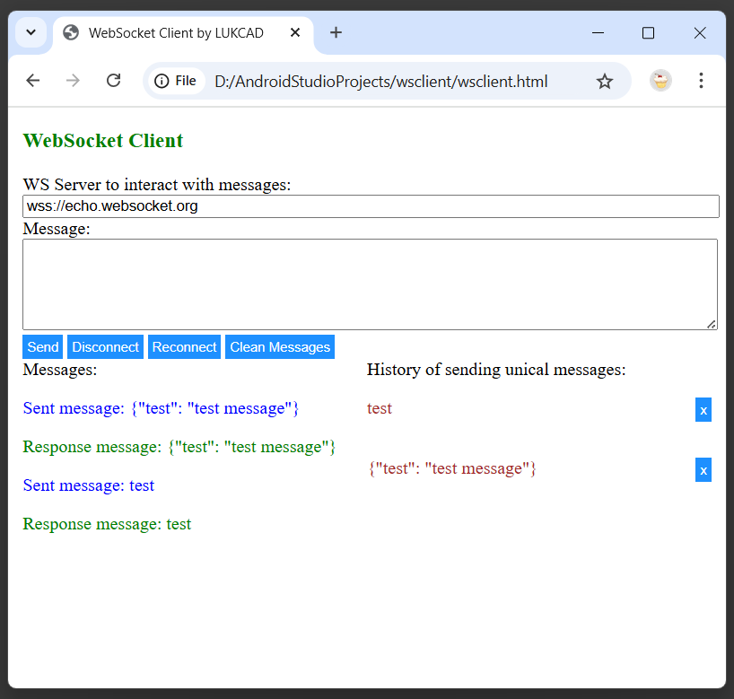
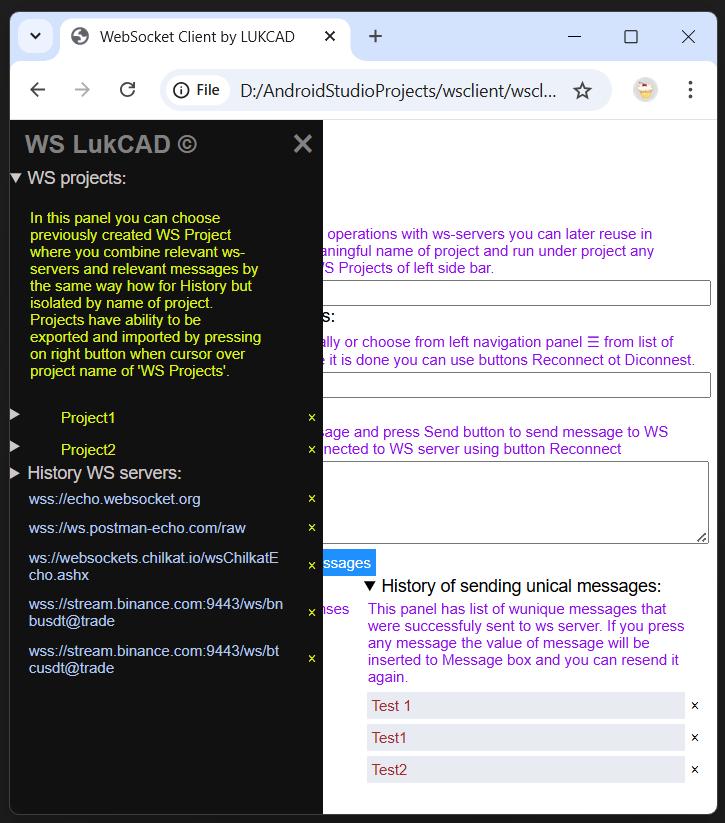
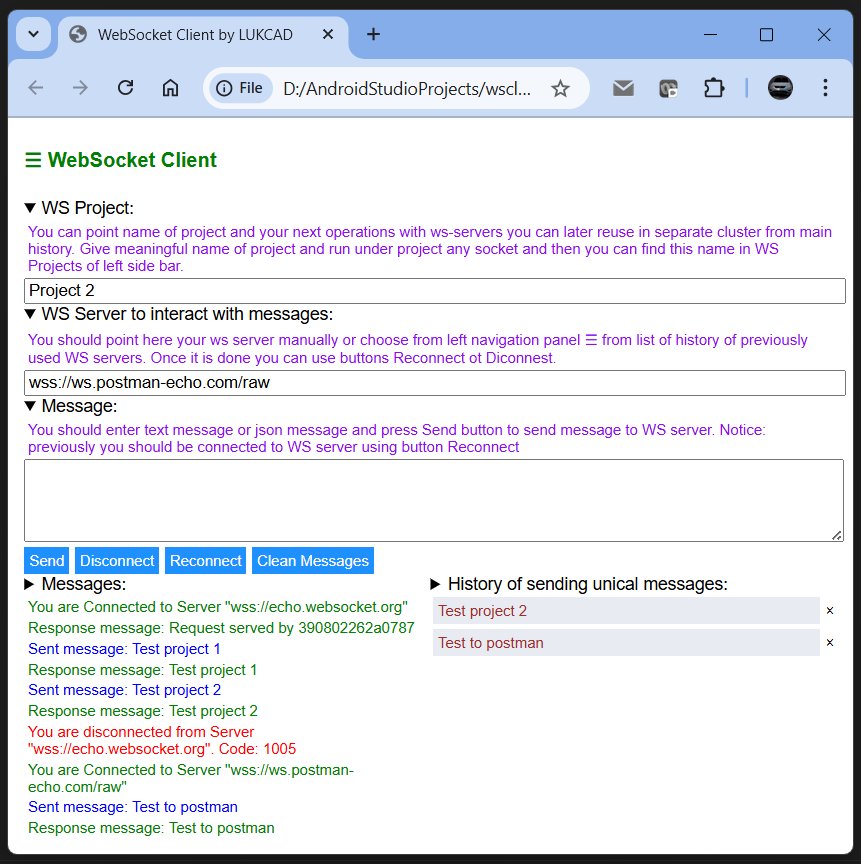
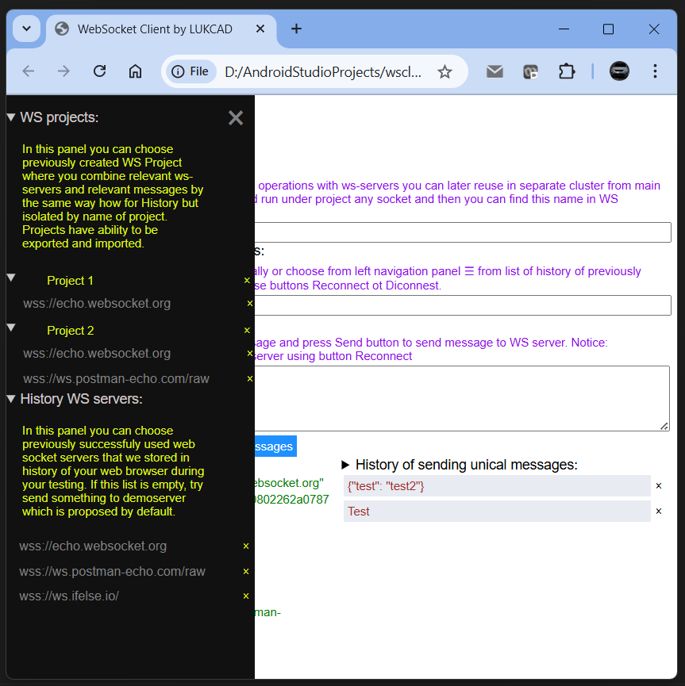

# Websocket client WSCLIENT.HTML

This client create websocket listener with name `socket` with all event  methods during start html page:

- socket.onopen
- socket.onclose
- socket.onmessage
- socket.onerror

where `socket` supports all actions:

- socket.close()
- socket.send(message)

`Html page` has interactive boxes and buttons to support:

- text box to name specific `WS project` ( if project is not pointed then WS servers and messages are saved in common history which is separate from specific project )

  - if `WS project` is pointed than you can find in left slide menu by icon &#9776; your created project in group named as `WS Projects`.
  - Every project saves succeded `WS servers` in own node and also own history messages. It helps you interact with your `ws sockets` like with projects in `Postman`.
  - if you don't need project you can delete it. Togethter with project list of ws servers and history that belong to project will be deleted as well.
  - if you have to import project from your local machine you can do it by item `Import project` from context menu when you press right button on group `WS Projects` when left side bar is opened.
  - if you need export any project from group of `WS Projects` of left side bar you can press the name of project by right button to start context menu where you can choose `Export project` item.

- text box to point WS server ( by default it is: `wss://echo.websocket.org` );
- text box to enter message which you wish to send to WS server;

- button `Disconnect` to stop connection to WS server.
- button `Reconnect` to start connection to WS server again after stop.
- button `Clean Messages` to remove messages from panel `Messages`.
- button `Send` - to send message from text box to WS and get response. if sending succeed then sending message will be added to history if it is unical.
  
  - pressed text in `History` panel will be copied to text box for `Message` to speed up your testing.
  - you can remove any message from `History` of messages by using `X` button  with confirmation prompt.

- icon &#9776; will open `left side bar` where you can re-choose previously saved successful WS servers:

  - you can choose another server from `History WS Servers` and previouse will be closed and the choosen server will be opened.
  - you can remove any WS server from `History WS Servers` by using `X` button with confirmation prompt.

`Information how to use` is provided by details text which can be expanded or hided when you press on item of page which has this symbol: &#x27A4;

Panel `Histoy of sending unical messages` helps you keep history of messages to re-use those for re-sending when you re-open client or clean up messages. 

You can use this `wsclient.html` with `Firefox`, `Edge` or `Chrome` browsers or any others browsers that support `Local Storage` to let keep your history.

Latest version of html code of `wsclient.html` is always on GitHub in public access: [Latest version wsclient.html](https://github.com/lukcad/wsclient/blob/main/wsclient.html)

You can simply clone project from GitHub and start use file `wsclient.html` for your web socket servers.

```
git clone https://github.com/lukcad/wsclient.git
```



