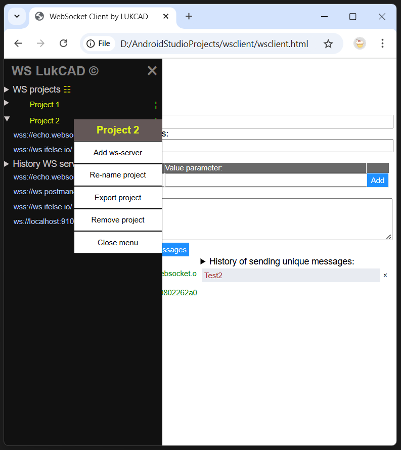
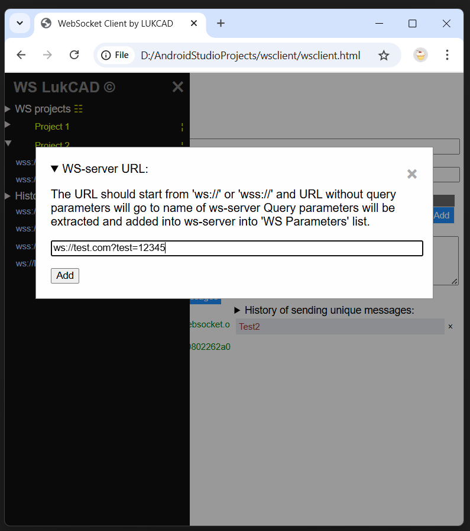

# Websocket client WSCLIENT.HTML

## Overview

`wsclient.html` is a single client file which works in all browsers by using just only HTML and pure javascipt.

### Arcitecture

- This client creates websocket listener with name `socket` with all event methods during start html page or during pressing button for re-coonection:

  - socket.onopen
  - socket.onclose
  - socket.onmessage
  - socket.onerror

- web socket listener `socket` supports all actions:

  - socket.close()
  - socket.send(message)

### User Interface of client

`Html page` has interactive elements to support:

- MAIN WORKING AREA:
  - text box to name specific `WS project` ( if project is not pointed then WS servers and messages are saved in common history which is separate from specific project )

    - if `WS project` is pointed than you can find it in `left slide menu` by icon &#9776; your created project in group named as `WS Projects`.
  - text box to point WS server ( by default it is: `wss://echo.websocket.org` );
  - text box to enter message which you wish to send to WS server;

  - button `Disconnect` to stop connection to WS server.
  - button `Reconnect` to start connection to WS server again after stop.
  - button `Clean Messages` to remove messages from panel `Messages`.
  - button `Send` - to send message from text box to WS and get response. if sending succeed then sending message will be added to history if it is unical.
  - Panel `Messages` shows all conversation with web socket server:
    - what message you sent;
    - what response has been received;
    - what kind error has been encountered;
    - reaction on reconnect and disconnet buttons;

  - Panel `Histoy of sending unical messages` helps you keep history of messages to re-use those for re-sending when you re-open client or clean up messages.
    - pressed text in `History` panel will be copied to text box for `Message` to speed up your testing.
    - you can remove any message from `History` of messages by using `X` button  with confirmation prompt.
  - icon button &#9776; in upper left corner of main working area opens `Left side menu`.

- LEFT SLIDE MENU:

  `Left slide menu` lets you work with projects and history. There are two groups in menu:
  
  - Group `WS Projects`

    - You can `add new project` with by executing sending request when `Project name` is filled in or `enrich existing project`.
    - You can `remove project` together with relevant ws servers and history using context menu by right button or icon &nbsp;&brvbar;&nbsp; and then by choosing `Remove project`.
    - You can `ws-server remove from project` if you expand list servers and press icon &times; against name of server.
    - if you have to `import new project` or `enrich existing project` from your local machine you can do it by context menu pressing right button on name group `WS projects` and press `Import project/history`. Also you can open context menu to execute this operation by using icon &#9783;.
    - if you have to `export project` you can press the name of project by right button to start context menu where you can choose `Export project` item.

  - Group `History WS servers`

    - You can `add new ws-server` here when send successful message with empty `Project name`.
    - You can `remove` any `ws server` using icon &times;
    - you can `export history ws-servers` by pressing righ button on `History WS servers` and choosing from context menu `Export history` item. Also you can open context menu to execute this operation by using icon &#9783;.

### General Notices

- `Information how to use` is provided by details text which can be expanded or hided when you press on item of page which has this symbol: &#x27A4;

- You can use this `wsclient.html` with `Firefox`, `Edge`, `Chrome` or `Opera` browsers and with any other browsers that support `Local Storage` to let keep your histories of ws-servers and messages.

- Latest version of html code of `wsclient.html` is always on GitHub in public access: [Latest version wsclient.html](https://github.com/lukcad/wsclient/blob/main/wsclient.html)

- You can export and import `WS Projects` of `History WS servers` between your browsers or colleagues using files `*.wsclient`.

## How ot use

You can simply clone project from GitHub and start use file [`wsclient.html`](wsclient.html) for your testing of sending messages to web socket servers, by using in terminal of your VS code studio this command:

```
git clone https://github.com/lukcad/wsclie
```



