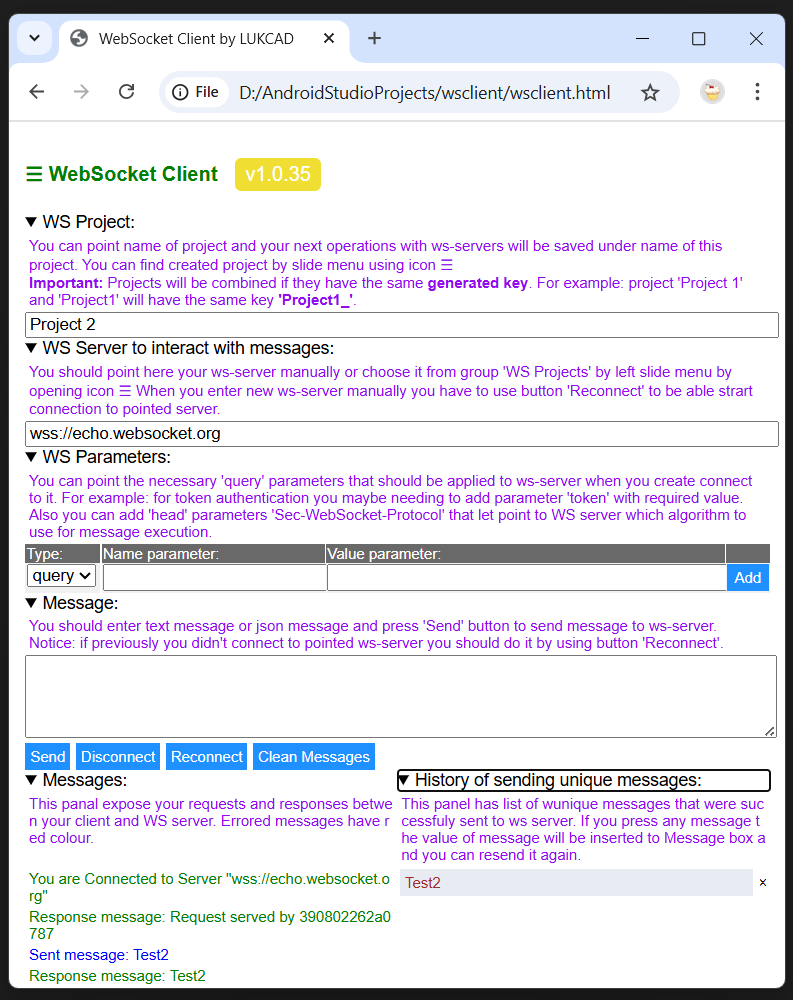
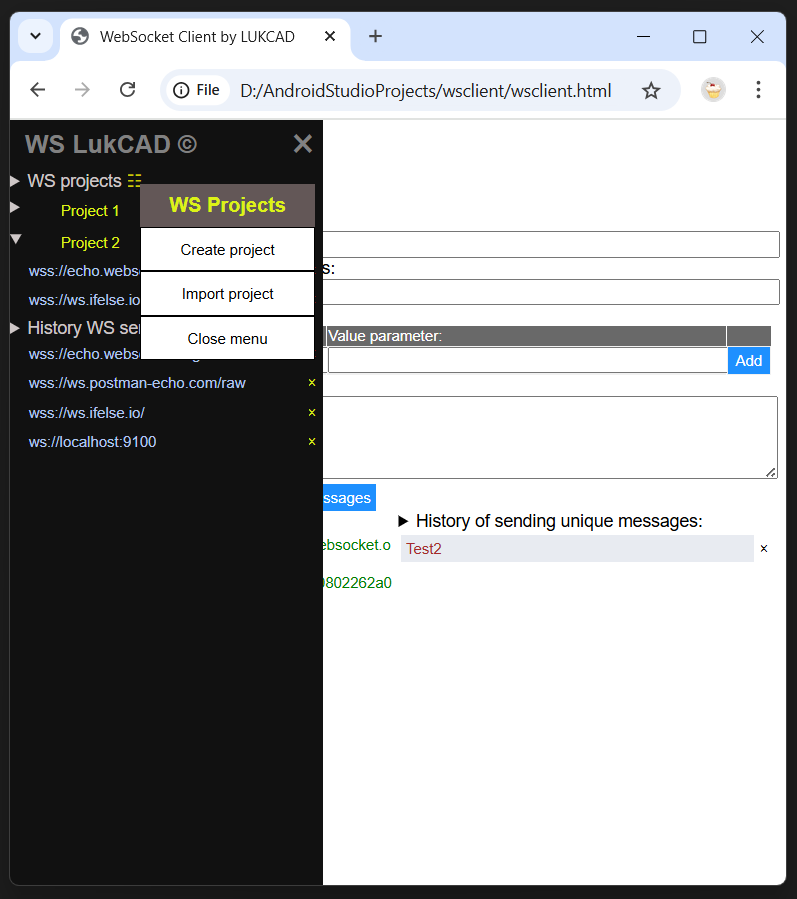
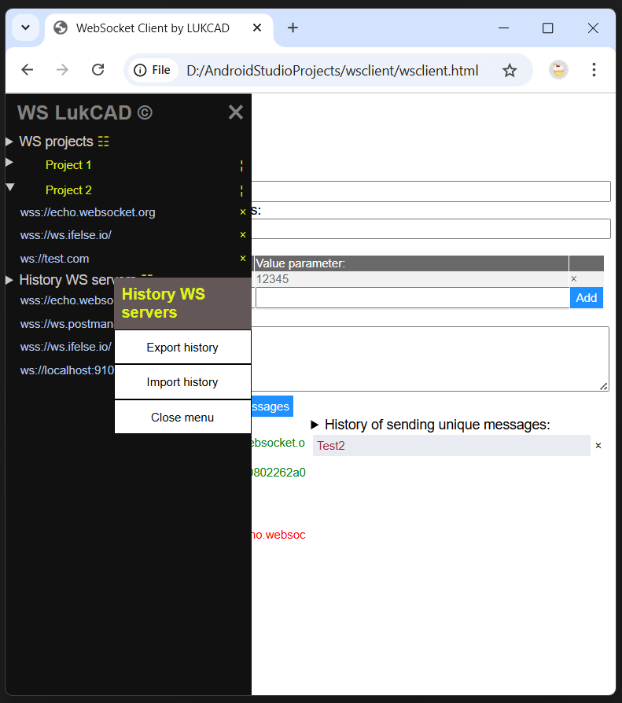
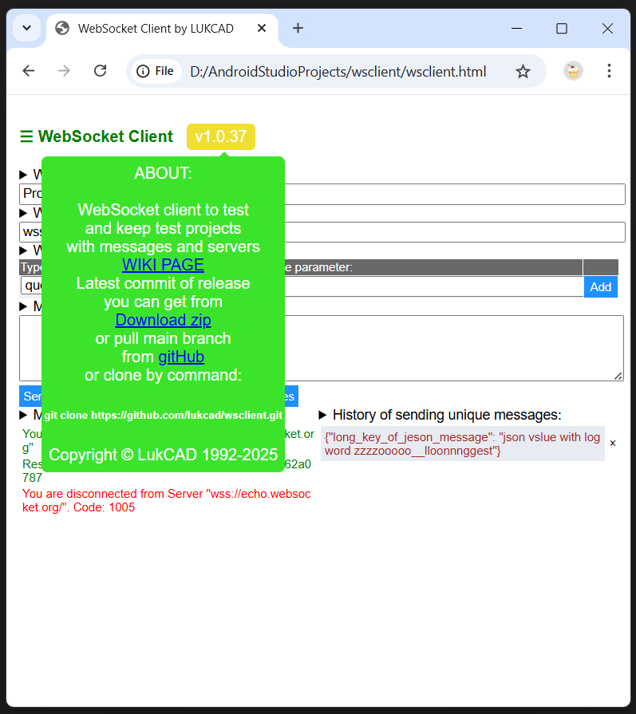

# Websocket client WSCLIENT.HTML

Clone or [download project](https://github.com/lukcad/wsclient/archive/refs/heads/main.zip) and use locally only file `wsclient.html` as a WebSocket client.

## Overview

`wsclient.html` is a single client file which works in all web browsers by using just only HTML and pure JavaScript with saving history, ws-servers and your projects into local storage of web browser.

### Arcitecture

- This client creates websocket listener with name `socket` with all event methods during start html page or during pressing button for re-connection:

  - socket.onopen
  - socket.onclose
  - socket.onmessage
  - socket.onerror

- web socket listener `socket` supports all actions:

  - socket.close()
  - socket.send(message)

### User Interface of client

`Html page` has interactive elements to support:

- MAIN WORKING AREA:
  - text box to name specific `WS project` ( if project is not pointed then WS servers and messages are saved in common history which is separate from specific project )

    - if `WS project` is pointed than you can find it in `left slide menu` by icon &#9776; your created project in group named as `WS Projects`.

  - text box to point WS server ( by default it is: `wss://echo.websocket.org` );
  - text box to enter message which you wish to send to WS server;

  - button `Disconnect` to stop connection to WS server.
  - button `Reconnect` to start connection to WS server again after stop.
  - button `Clean Messages` to remove messages from panel `Messages`.
  - button `Send` - to send `Message` from text box to WS-server and get response:
    - if sending succeed then the sent message will be added to history if it is unique and purged from `Message` text box.
    - if it was detected that the socket was not opened yet or previously closed then `alert message` will appear with explanation of situation and asking you to press button `Reconnect` to let you repeat sending mssage from `Message` text box.
    - if during sending with opened web socket some error were detected on server side, the response message returns code or error and web socket will be closed.
  - List of `WS Parameters` where you can at this moment:
    - add new parameter with type `query` and your required name and value;
    - add new value with type `head` and only for `Sec-WebSocket-Protocol` parameter, you can add many such parameters. This parameter is considered by WS-Servers as a `Protocol` name which is specific of algorithm implemented by server.
    - remove not needing parameter;

      Notices: `WS parameters` list help you add necessary parameters which some ws-servers use for authentication, currently it is one of the simplest ways to verify authentication during connection of client to ws-server; Because there are another ways of authentication, in next releases new type of parameter can be added.

  - Panel `Messages` shows all conversation with web socket server:
    - what message you sent;
    - what response has been received;
    - what kind error has been encountered;
    - reaction on reconnect and disconnect buttons;

  - Panel `History of sending unique messages` helps you keep history of messages to re-use those for re-sending when you re-open client or clean up messages.
    - pressed text in `History` panel will be copied to text box for `Message` to speed up your testing.
    - you can remove any message from `History` of messages by using `X` button  with confirmation prompt.
  - icon button &#9776; in upper left corner of main working area opens `Left slide menu`.

- LEFT SLIDE MENU:

  `Left slide menu` lets you work with projects and history. There are two groups in menu:
  
  - Group `WS Projects`

    - You can `add new project` into this group by two ways:

      - By executing sending request in main working area when `Project name` is filled in with new name of project.
      - By using context menu of `WS Projects` and choosing item `Create project`.

    - You can `add ws-server` into any project from group also by two ways:

      - By executing sending request in main working area for chosen project when `WS Server to interact with messages` is filled in with new name of URL of ws-server.
      - By using context menu of any project and choosing item `Add ws-server`. Specific adding in this case is the next:

        - URL will be checked that exists `ws://` or `wss://` in the beginning;
        - from URL will be extracted name of ws-server if URL includes separator `?` for query parameters;
        - from URL will be extracted all query parameters and added to `WS parameters` list for this server if URL includes separator `?` for query parameters and parameters using `=`.

    - You can `re-name project` together with relevant ws servers and history using context menu by right button or icon &nbsp;&brvbar;&nbsp; and then by choosing `Re-name project`.
    - You can `remove project` together with relevant ws servers and history using context menu by right button or icon &nbsp;&brvbar;&nbsp; and then by choosing `Remove project`.
    - You can `ws-server remove from project` if you expand list servers and press icon &times; against name of server.
    - if you have to `import new project` or `enrich existing project` from your local file you can do it by context menu pressing right button on name group `WS projects` and press `Import project`. Also you can open context menu to execute this operation by using icon &#9783;.
    - if you have to `export project` using context menu by right button or icon &nbsp;&brvbar;&nbsp; and then by choosing `Export project`.

  - Group `History WS servers`

    - You can `add new ws-server` here when send successful message with empty `Project name`.
    - You can `remove` any `ws server` using icon &times;
    - You can `import history ws-servers` from local file by pressing pressing righ button on `History WS servers` and choosing from context menu `Import history` item. Also you can open context menu to execute this operation by using icon &#9783;.
    - you can `export history ws-servers` to local file by pressing righ button on `History WS servers` and choosing from context menu `Export history` item. Also you can open context menu to execute this operation by using icon &#9783;.

### General notices

- `Information how to use` is provided by details text which can be expanded or hided when you press on item of page which has this symbol: &#x27A4;

- You can use this `wsclient.html` with `Firefox`, `Edge`, `Chrome` or `Opera` browsers and with any other browsers that support `Local Storage` to let keep your histories of ws-servers and messages.

- Latest version of html code of `wsclient.html` is always on GitHub in public access: [Latest version wsclient.html](https://github.com/lukcad/wsclient/blob/main/wsclient.html)

- You can export and import `WS Projects` of `History WS servers` between your browsers or colleagues using files `*.wsclient`.

## How to use

You can simply clone project from GitHub and start use file [`wsclient.html`](wsclient.html) by any web browser locally on your computer or mobile for your testing and sending messages to web socket servers.

I recommend clone repository using git command

```bash
git clone https://github.com/lukcad/wsclient.git
```

and then create `link` to `wsclient.html` file to let use this link by web-browser (`Firefox`, `Chrome`, `Edge`, `Opera`) when you need provide websoket testing on your local workstation or on your own Mobile. Also, having git clone it will be easier to update new version of client when you get message about new release. It is more convinient just pull new version from git rather than download new zip file, extract and copy `wsclient.html` file.

```bash
git pull
```

Notices:

- All your projects and history will be saved by this WebSocket client into your browser only.
- New version of client does not impact previously created projects, so after upgrade to new version you can continue use your previously created projects.
- You can easily export and import projects between web browsers to save time if you need provide testing sockets from different web browsers.
- On Mobile `websocket.html` you can open by any `File manager`. And during opening you can use these web browsers in mobile mode: `Edge`, `Chrome`, `FireFox`, `Opera`, `Samsung Internet` and many others that support local storage.
- If you clean up local storage of your web browser (you can do it by settings in browser) then you will clean up all projects and history for WebSocket client. Recommendation here: export (by functionality of WebSocket client) time by time important projects to your local file storage of workstation.








