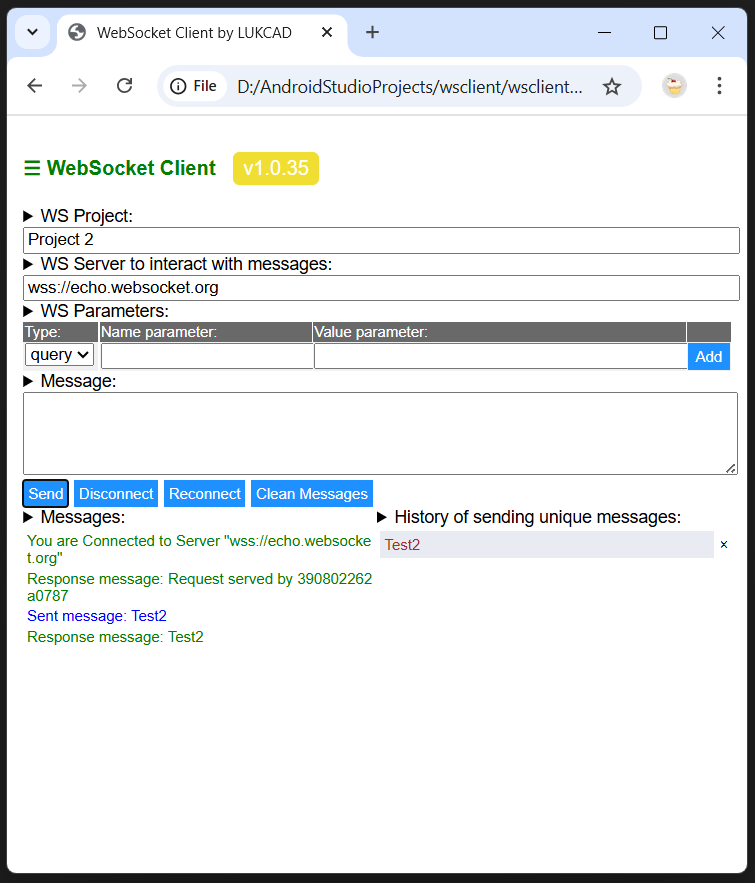

# Websocket client WSCLIENT.HTML

This client create websocket listener with name `socket` with all event  methods during start html page:

- socket.onopen
- socket.onclose
- socket.onmessage
- socket.onerror

where `socket` supports all actions:

- socket.close()
- socket.send(message)

`Html page` has interactive boxes and buttons to support:

- text box to point WS server ( by default it is: `wss://echo.websocket.org` );
- text box to enter message which you wish to send to WS server;
- button `Send` - to send message from text box to WS and get response.
- button `Disconnect` to stop connection to WS server.
- button `Reconnect` to start connection to WS server again after stop.
- button `Clean Messages` to remove messages from panel `Messages`.
- pressed text in `History` panel will be copied to text box for `Message` to speed up your testing.
- you can remove from `History` any messages by using `X` button.

Panel `Histoy of sending unical messages` helps you keep history of messages to re-use those for re-sending when you re-open client or clean up messages. 

You can use this `wsclient.html` with `Firefox`, `Edge` or `Chrome` browsers or any others browsers that support `Local Storage` to let keep your history.

Latest version of html code of `wsclient.html` is always on GitHub in public access: [Latest version wsclient.html](https://github.com/lukcad/wsclient/blob/main/wsclient.html)

You can simply clone project from GitHub and start use file `wsclient.html` for your web socket servers.

```
git clone https://github.com/lukcad/wsclient.git
```

